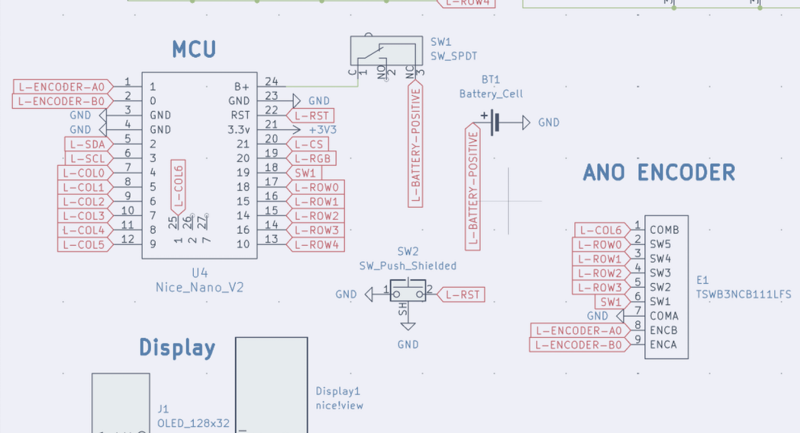

# JOURNAL.md

---

title: "quartz58"
author: "tim"
description: "attempt at a next to no compromises keyboard"
created_at: "2025-07-15"

---

**Total Time Spent**:

## ~May-July 14: Research

- Researched split keyboards, specifically Lily58 and Corne layouts.
- What I wanted in a keyboard/use, if I wanted a track pad, rotatory knob, leds etc.
- At the same time learned about, how to use and created a layout on Ergogen, and starting on the pcb. (although later this was just used for key layout due to the amount of custom parts being used)
- Came up with a list and created a google doc to document everything found and what needs to be worked on.
- Compared and contrasted if I wanted a oled or nice!view epaper screen, with RGB to figure out battery life (just decided to go with nice!view and per key RGB and potentially 4000-2000mAh battery to also add weight)
- Also decided to go with MX switch footprint instead of choc, due to mx's superior sound and I'm not ready to commit fully to choc switches
- Found more specific parts such as the TPS65 Touchpad, ANO rotary wheel and comparing that to models such as the cirque track pad, and conventional knobs

- Created onshape to continue to mess with the layout and the dimensions of the new parts

**NOTE**: I started doing early planning, and researching part on and off throughout march, early july due to other commitments, but majority of design and firmware development is happening in July (from now on).

**Time Spent**: 8 hours

## July 15: True Beginning

- Created Github repo
- Uploaded all my documents here and started writing the journal

**Time Spent**: 1.5 hours

## July 17: Progress & Decisions

#### Ergogen Config

- Simplified the Ergogen configuration to focus solely on the key layout, removing PCB-specific elements.

#### TRRS Conundrum

- Considered adding a TRRS port as a fallback for situations without batteries or when using a Pro Micro instead of a Nice!Nano (or equivalents).
- Faced challenges with limited pin availability and potential voltage conflicts if both sides are connected.
- Evaluated compatibility with ZMK firmware.
- Ultimately decided **not** to include the TRRS port for now. If issues arise, each half will be connected separately to the computer.

#### ANO Directional Navigation & Scroll Wheel Rotary Encoder

- Spent significant time searching for pre-made schematic symbols and footprints.
- Discovered the white version of the encoder (TSWB3NCB111LFS) available on Digi-Key.
- Located the data sheet, enabling future creation of a custom PCB footprint.

#### TPS65 Trackpad

- Found the data sheet, which will help in creating a custom symbol for schematic integration.

#### Schematic Progress

- Completed basic schematic elements.
- Next steps: create custom symbols for the ANO encoder and TPS65 trackpad.

**Time Spent**: 6 hours

## July 18: DOWN THE RABBIT HOLE

### ANO Directional Navigation and Scroll Wheel Rotary Encoder

- After realizing that the TSWB3NCB111LFS encoder is not in stock anywhere, I decided to contact the creators of the soflePLUS2, which features this encoder.
- Reached out to them on Instagram; they mentioned being based in Malaysia, with their supplier in China—making shipping to Canada quite expensive.
- For now, I'll use the glossy Adafruit encoder, even though it may not match the color scheme.

### Schematic

- Learned how to create symbols in KiCad and completed basic symbols for the trackpad and encoder.
- Refined more of the schematic and started assigning footprints.

|  |  |
| :------------------------------------------: | :------------------------------------------------------: |

**Time Spent**: 4.5 hours

## July 19

#### Custom Choc + MX hotswap

- Due to my indecision I decided to make sure that I could use both choc and MX switches on these pcbs.
- After tons of googling I couldn't find what I was looking for, although I could find it in one of the keyboards that I am using for inspo, the sofle plus 2.
- They just layered it on top of each other so you could just chose and they had the LED at the bottom still.
- So I decided to take the same approach and just layer two hotswap footprints on top of each other to achieve this, by following a guide on the kicad forms, which was just copying text from one file to another

- I then cleaned it up with some of the overlays stacking.
- I do plan on making it more polished with the outlines and looks more complete, but since it doesn't effect anything else right now, only asthenics I'll worry it about it later.

#### Starting PCB Laying out

- I first did all the basic stuff just assigning footprints, however I didn't for my trackpad and encoder as im making those later and I'll just insert it later.
- I then spent an hour just attempting to layout the switches according to the ergogen, then I figured out that I could just use the ergogen one, import it into mine, change the footprint to my type of switch
- I also roughly placed some of the components such as diodes and leds to get here

- Although when doing this I ran into a problem where my thumb key was a bit too close to each other so I had to go back to ergo gen and fix that, then import it back and align it by stacking a nearby switch to not ruin the other progress I've made

- So far my thoughts are that I might be way in over my head due to only ~10 days being left and still so much todo (CAD and zmk) and the goals I want to achieve with this keyboard, but I think I got this!!

**Time Spent**: 5.5 hours

## July 23

- I had to take a break to focus on finishing my summer school, and today I just took the final exam and now I'm back, hopefully I can finish this in time

#### ANO Encoder Update

- After reviewing the encoders data sheet I realized I had wired the encoder wrong and I can't integrate SW1 into the matrix
- So I just used one of the middle pins on the nice nano

|  |  |
| :----------------------------------------------------------------: | :---------------------------------------------------------: |

- Tomorrow I will make the pcb for this ANO Encoder

#### General Planning/PCB

- Figured that instead of just placing each led and diode one by one, which is repetitive and might lead to mistakes I will just instead just do it in ergo gen and change the footprints and assign them like what I did for the switches
- I might also do this for the MCU placement n stuff
- As I'm mixing 19.05mm with 1mm stuff which makes it tricky to make it all consistent
- which I started doing today, I also minimized the perimeter of the pcb to allow for

**Time Spent**: 1.5 hours

## July 23

#### General PCB Stuff

- Readjusted my thumb key again to make it perfect with the references of onshape
- I decided I liked the look of a smaller pcb that minimizes the area instead of the normal lily58 so I changed that in ergogen (taking wayy longer than I thought bc ergogen isn't as easy to use as onshape)
- Also I put in the leds in ergogen so I can remove me manually placing it which could lead to mistakes, I didn't do this with the diodes like I planned but I want to place them fancy later to efficiently use up the space
- this lead me to basically restarting the pcb, and I'ma

|  |  |
| :------------------------------------------------------: | :---------------------------------------: |

- I also found side mounting of the buttons and switches that I will be using!
  - The SSSS and panasonic one, used on the typeractive keyboards

|  |  |  |
| :---------------------------------------------------: | :---------------------------------------------------------: | :-----------------------------------------------------------------: |

#### CAD more scafolding

- I added in the components into the cad with the keys in a sketch to plan out where everythings gonna go
  - Although I am still missing the acrylic cover I'm gonna make to cover the mcu and display

**Time Spent**: 4.5 hours
