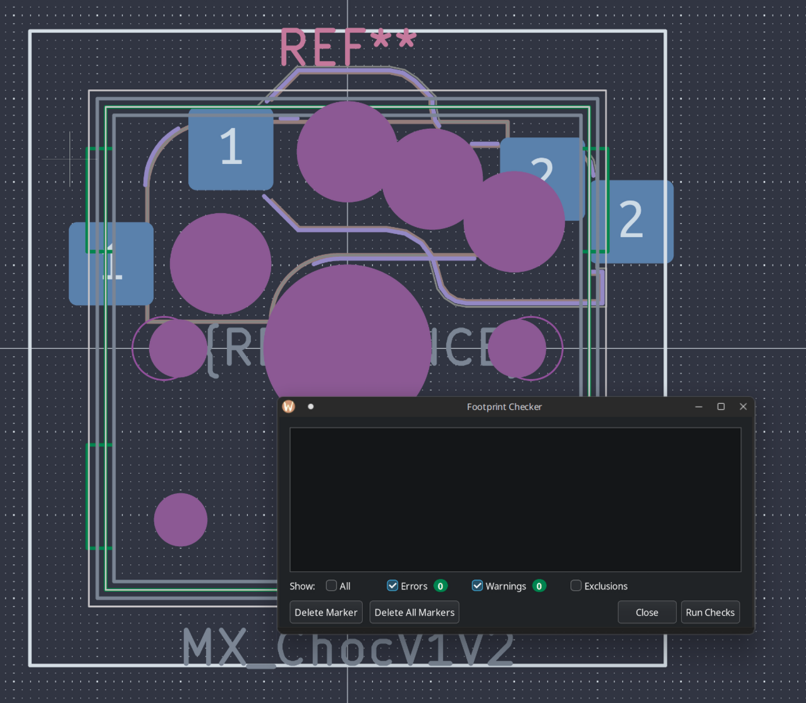
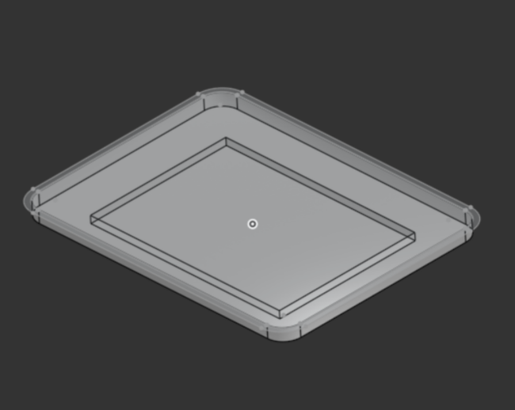

# JOURNAL.md

---

title: "quartz58"
author: "tim"
description: "attempt at a next to no compromises keyboard"
created_at: "2025-07-15"

---

**Total Time Spent**: 78.5 hours

## ~May-July 14: Research

- Researched split keyboards, specifically Lily58 and Corne layouts.
- What I wanted in a keyboard/use, if I wanted a track pad, rotatory knob, leds etc.
- At the same time learned about, how to use and created a layout on Ergogen, and starting on the pcb. (although later this was just used for key layout due to the amount of custom parts being used)
- Came up with a list and created a google doc to document everything found and what needs to be worked on.
- Compared and contrasted if I wanted a oled or nice!view epaper screen, with RGB to figure out battery life (just decided to go with nice!view and per key RGB and potentially 4000-2000mAh battery to also add weight)
- Also decided to go with MX switch footprint instead of choc, due to mx's superior sound and I'm not ready to commit fully to choc switches
- Found more specific parts such as the TPS65 Touchpad, ANO rotary wheel and comparing that to models such as the cirque track pad, and conventional knobs

- Created onshape to continue to mess with the layout and the dimensions of the new parts

**NOTE**: I started doing early planning, and researching part on and off throughout march, early july due to other commitments, but majority of design and firmware development is happening in July (from now on).

**Time Spent**: 8 hours

## July 15: True Beginning

- Created Github repo
- Uploaded all my documents here and started writing the journal

**Time Spent**: 1.5 hours

## July 17: Progress & Decisions

#### Ergogen Config

- Simplified the Ergogen configuration to focus solely on the key layout, removing PCB-specific elements.

#### TRRS Conundrum

- Considered adding a TRRS port as a fallback for situations without batteries or when using a Pro Micro instead of a Nice!Nano (or equivalents).
- Faced challenges with limited pin availability and potential voltage conflicts if both sides are connected.
- Evaluated compatibility with ZMK firmware.
- Ultimately decided **not** to include the TRRS port for now. If issues arise, each half will be connected separately to the computer.

#### ANO Directional Navigation & Scroll Wheel Rotary Encoder

- Spent significant time searching for pre-made schematic symbols and footprints.
- Discovered the white version of the encoder (TSWB3NCB111LFS) available on Digi-Key.
- Located the data sheet, enabling future creation of a custom PCB footprint.

#### TPS65 Trackpad

- Found the data sheet, which will help in creating a custom symbol for schematic integration.

#### Schematic Progress

- Completed basic schematic elements.
- Next steps: create custom symbols for the ANO encoder and TPS65 trackpad.

**Time Spent**: 6 hours

## July 18: DOWN THE RABBIT HOLE

### ANO Directional Navigation and Scroll Wheel Rotary Encoder

- After realizing that the TSWB3NCB111LFS encoder is not in stock anywhere, I decided to contact the creators of the soflePLUS2, which features this encoder.
- Reached out to them on Instagram; they mentioned being based in Malaysia, with their supplier in China—making shipping to Canada quite expensive.
- For now, I'll use the glossy Adafruit encoder, even though it may not match the color scheme.

### Schematic

- Learned how to create symbols in KiCad and completed basic symbols for the trackpad and encoder.
- Refined more of the schematic and started assigning footprints.

|  |  |
| :------------------------------------------: | :------------------------------------------------------: |

**Time Spent**: 4.5 hours

## July 19

#### Custom Choc + MX hotswap

- Due to my indecision I decided to make sure that I could use both choc and MX switches on these pcbs.
- After tons of googling I couldn't find what I was looking for, although I could find it in one of the keyboards that I am using for inspo, the sofle plus 2.
- They just layered it on top of each other so you could just chose and they had the LED at the bottom still.
- So I decided to take the same approach and just layer two hotswap footprints on top of each other to achieve this, by following a guide on the kicad forms, which was just copying text from one file to another

- I then cleaned it up with some of the overlays stacking.
- I do plan on making it more polished with the outlines and looks more complete, but since it doesn't effect anything else right now, only asthenics I'll worry it about it later.

#### Starting PCB Laying out

- I first did all the basic stuff just assigning footprints, however I didn't for my trackpad and encoder as im making those later and I'll just insert it later.
- I then spent an hour just attempting to layout the switches according to the ergogen, then I figured out that I could just use the ergogen one, import it into mine, change the footprint to my type of switch
- I also roughly placed some of the components such as diodes and leds to get here

- Although when doing this I ran into a problem where my thumb key was a bit too close to each other so I had to go back to ergo gen and fix that, then import it back and align it by stacking a nearby switch to not ruin the other progress I've made

- So far my thoughts are that I might be way in over my head due to only ~10 days being left and still so much todo (CAD and zmk) and the goals I want to achieve with this keyboard, but I think I got this!!

**Time Spent**: 5.5 hours

## July 23

- I had to take a break to focus on finishing my summer school, and today I just took the final exam and now I'm back, hopefully I can finish this in time

#### ANO Encoder Update

- After reviewing the encoders data sheet I realized I had wired the encoder wrong and I can't integrate SW1 into the matrix
- So I just used one of the middle pins on the nice nano

|  |  |
| :-------------------------------------------------------------: | :---------------------------------------------------------: |

- Tomorrow I will make the pcb for this ANO Encoder

#### General Planning/PCB

- Figured that instead of just placing each led and diode one by one, which is repetitive and might lead to mistakes I will just instead just do it in ergo gen and change the footprints and assign them like what I did for the switches
- I might also do this for the MCU placement n stuff
- As I'm mixing 19.05mm with 1mm stuff which makes it tricky to make it all consistent
- which I started doing today, I also minimized the perimeter of the pcb to allow for

**Time Spent**: 1.5 hours

## July 24

#### General PCB Stuff

- Readjusted my thumb key again to make it perfect with the references of onshape
- I decided I liked the look of a smaller pcb that minimizes the area instead of the normal lily58 so I changed that in ergogen (taking wayy longer than I thought bc ergogen isn't as easy to use as onshape)
- Also I put in the leds in ergogen so I can remove me manually placing it which could lead to mistakes, I didn't do this with the diodes like I planned but I want to place them fancy later to efficiently use up the space
- This lead me to basically restarting the pcb

|  |  |
| :------------------------------------------------------: | :---------------------------------------: |

- I also found side mounting of the buttons and switches that I will be using!
  - The SSSS and panasonic one, used on the typeractive keyboards

|  |  |  |
| :---------------------------------------------------: | :---------------------------------------------------------: | :-----------------------------------------------------------------: |

#### CAD more scafolding

- I added in the components into the cad with the keys in a sketch to plan out where everything's gonna go
  - Although I am still missing the acrylic cover I'm gonna make to cover the mcu and display

**Time Spent**: 4.5 hours

## July 26

#### ANO Encoder

- Today I made significancy more progress on this encoder
- Made the footprint, which took a while as I've never done before and there wasn't one available online (THANK YOU DIGIKEY FOR THE AMAZING KICAD FOOTPRINT GUIDE)
  - Some notes about this footprint is that it took a surprisingly long time and a pain to make and line up with the schematic although after some time I made it work
- I ALSO FOUND THE GREAT FH12 FFC cable connectors to connect the trackpad and encoder daughterboard to their respective halves after tons of time searching
  - It also took sometime finding the footprint but luckly it was in the kicad footprints library :DD
- Also planned more out of this daughterboard pcb layout and dimensions in onshape

|  |  |  |
| :-------------------------------------------------------------: | :------------------------------------------------------------------------: | ------------------------------------------------------- |

#### General PCB

- Realized that the spacing between the center of the led and the center of the switch was 5.08 mm not the 4.5 I eyeballed by looking it up in the Keyboard Atelier discord
  - Making me change that entire thing in ergogen, then transferring it backk to kicad
- With that change and having the numbers on each of the components messed up I decided to renumber them in the schematic and then Kicad
  - Then I went through it all and make sure each switch and led lined up with its counterpart in the schematic which was wayy too tedious
  - At this point I settled on the leds going in a zig-zag pattern for wiring for simplicity and shorter run lengths
- I also started placing all of the diodes on one of the halves manually so I can have more space for fancy wiring and their traces for the switches

**Time Spent**: 6.5 hours

## July 27

- First thoughts, I might not be able to finish on time because of all the trouble I'm having with the pcb and other responsibility now also popping up in the next few days :/

#### General PCB

- In the morning I realized that the via's can't really be ontop of the pads so I changed each of them so they would be atleast 0.4mm away
- Continued routing this pcb and ran checks
  - This is where I got 1k+ errors due to my hacked together switch and sketch stuff, making me spend some time fixing that
  - First with the switches I switched some of the holes to edge cuts and changing some of the settings and tweaking the overrides, along with the leds

|  |  |  |
| :--------------------------------------------------: | :-------------------------------------------------: | ---------------------------------------------------------------------------------------------- |

#### ANO Encoder

- Created the general shape of the breakout board first in onshape then moving it to kicad
- I might need to rotate it so that the 7 and 5 pins are away from the right edge as that would be where they would be most visible as they poke out a bit more then the others

- Final thoughts for today, I think I need to finish the left side entirely tomorrow and I might be able to also start on the CAD and finish that within a day due to my experience
- I also might need to do a bare bones zmk config without the fancy online key editing just for this project to be submittable on time

**Time Spent**: 7 hours

## July 28

- Not sure why but I'm just having trouble focusing on this :// might be the amount of sleep I'm getting but I will try and get this done by hopefully end of 30th to leave the 31st for any last minute
- Also summer school has started once again which may become a problem in the next few days

#### ANO Encoder

- FINALLY SHOULD'VE HAD THIS 4 DAYS AGO
- Created daughter board footprint along with lining it up on the pcb with the connectors, also created a cutout so that the fpc connector can be passed through
- Also I rotated and rerouted the daughter board so it would work better

|  |  |  |
| :-------------------------------------------------: | :------------------------------------------------------------------------------: | ------------------------------------ |

#### General PCB

- Worked on routing so the left side is basically done and should be much faster to route the other with a blue print basically
- Got the errors down a bit more although they are minor and can be fixed relatively quickly
- Although I realized that this doesn't have the 0.5 fillets which I might add back with the help of ergogen
- Made the pcb exportable by fixing all of the outline errors with the mx switches and ano encoder

|  |  |  |
| :--------------------------------------------------------: | :-----------------------------------: | :---------------------------------------------------: |

- Also looking back on this pcb after developing more of the cad I might move the mcu along with the displays slightly
  - Additionally I need to figure out the mounting holes for the acrilic cover
- In the CAD this is also what I am planning so far

  - Thicker bezzels (~7mm or less)
    - Accommodate a ball catch mechanism like in the rd75
    - and to house a gasket mounting system
      - This will also most likely be a poron foam strips thing in the front and back mounted to the plate
      - Although this might be ditched and reduced to just a plate isolating system due to time and wanting the keyboard to be relatively thin

  **Time Spent**: 7 hours

## July 29

#### ANO ENCODER

- Redid polarity of the encoder to work with the type A ffc cable
- Also slightly reduced the size of the daughter board

|  |  |  |
| :----------------------------------: | :---------------------------------------------------------------------: | :-----------------------------------------------------------: |

#### General PCB

- Updates to pcb by editing ergogen then importing into kicad to have the .5 fillet on the pcb so its smoother

#### CAD

- Worked on CAD, added the plate, top case, and bottom case so far
- I also added the supporting such as the headers for the mcu, and adding in the ano encoder with the nice!view display
- Additionally I laid out where the ball catch mechanisms are suppose to go along with the poron gaskets
- I spent a bit too long on figuring out how to create the case in the way I wanted due to all of the variables, although I figured it out in the end with a bunch of sketches

https://cad.onshape.com/documents/873cec737929b1b06537c433/w/1c9e733c7d397ada1b99a04d/e/52e5a88970633a5c0f63818b

|  |  |  |
| :---------------------------------: | :--------------------------------------------------------------------------------: | :---------------------------------------------------------: |

**Time Spent**: 8 hours

## July 30: LOWKEY REALLY BEHIND

#### CAD and PCB Stuff

- Worked a bit on placement of the trackpad and creating a bounding box, starting on a case for that
- Also rearranged a bit of the mcu with the display so they would all fit correctly above the switch
  - Additionally I made sure the usbc wouldnt stick past the pcb so I made it 0.2mm away from the edge to play it safe

|  |  |
| :---------------------------------------------------------------------: | :-----------------------------------------------------------------: |

    before and after!

|  |  |
| :-------------------------------------------------------------------------------------: | :----------------------------------------------------------------------------: |

#### MONUMENTAL ZMK RUN

- I first imported the standard lily58 zmk config
  - Customized to fit my pins, added my own shield and the encoder with its 4 buttons
- When working on it I realized that I needed to make the numbering consistent so I make the go from 0 on the left and +1 as it got to the right cols
- Swaped around the cs and rgb pins to high frequency ones because of reading through the docs it recommended that
- So then I was ready to compile and it just wouldn't work so I used github co-pilot to help me understand the errors along with a friend, and then many iterations later...
- After commenting out the cs nice!view and trackpad stuff it compiled!!!
  https://github.com/timwhat/zmk-config-quartz58/tree/main
- So if I have any time remaining for this I will continue to make these features work and add additional features such as cool rgb affects, If not I will work on it while I wait for my parts to ship

|  |  |
| :-------------------------------------: | :---------------------------------------------------: |

**Time Spent**: 7.5 hours

## July 31: Basically done

- Will write more in a few hours to document what's been done but completed wiring on both sides of pcb
  - I will clean up the wiring on the right side as it was really rushed to get it in by the deadline (making the traces look nicer with some pcb pattern)

#### CAD and PCB Stuff

- Completely finished routing everything
  - While doing this I made some changes to schematic to make routing some of the traces easier
- Created Gerber files for quote
- Created TPS65 Mount along with other minor stand offs
- Continuously refined case
  - Added Magsafe and gaskets for visuals

|  |  |
| :--------------------------: | :--------------------------: |

- Wrote BOM list
- Completed README requirements

- My Next Steps
  - Rename the files in the kicad to match conventions
  - Continue to polish the pcb traces and silkscreens (currently **FULLY** working this is just for asthenics)
  - Continue to refine case if any ideas or thoughts for improvements pop up
  - Complete ZMK as it compiles and test on the real keyboard once received

**Time Spent**: 11 hours
