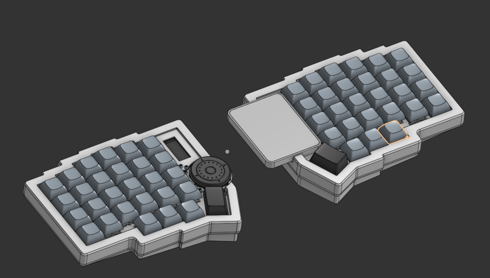
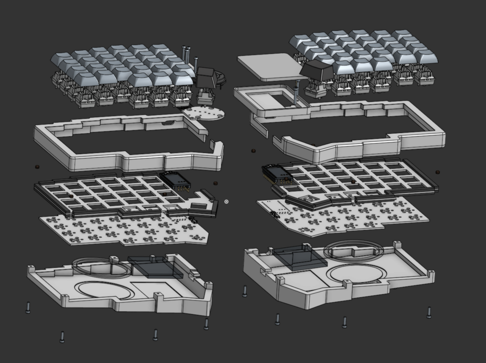
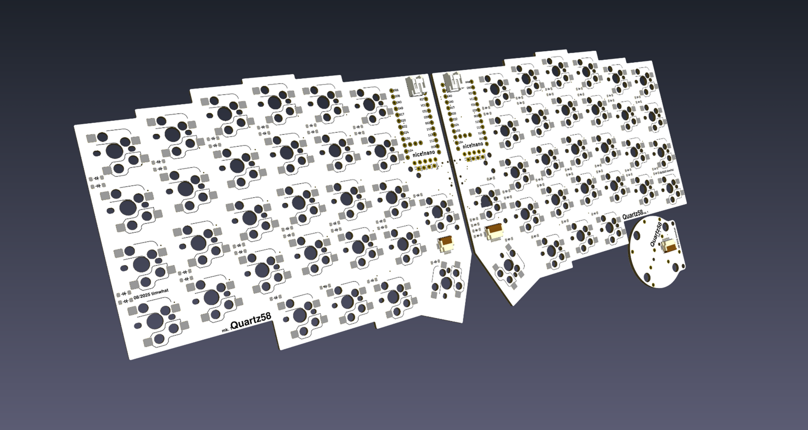
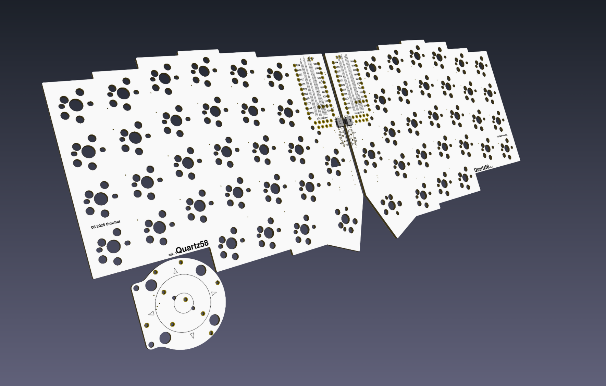
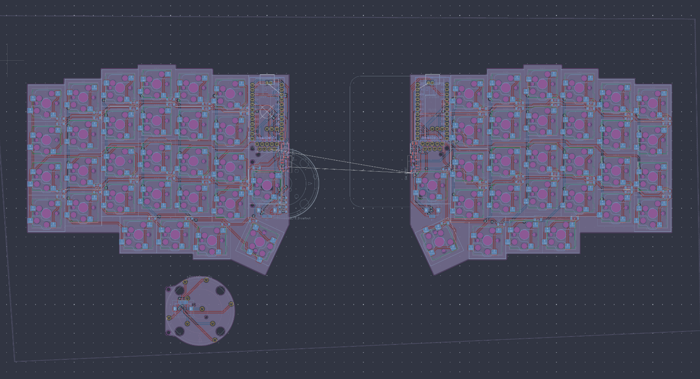
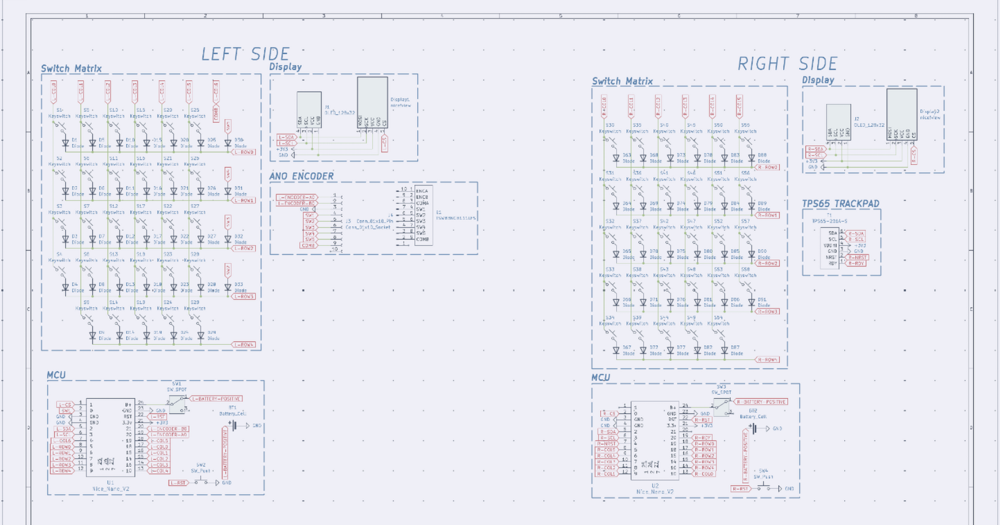

# Quartz58

Attempt at a two places removed, no compromises keyboard

Inspired by the lily58, SoflePLUS2, and MANY others to fit my personal needs

## Images

### CAD

Exploded view of the CAD currently

### PCB

BASE!

### Schematic

The reason why I made this project was that I was always fascinated by keyboards, especially the ergonomic ones, and I just love designing things. So since this was my chance to try it, so I jumped at it!

## Features

### Key Features

- **58 keys**, each able to support at the same time, MX and Choc hotswap sockets!

- **Wireless**, with the power of a nice!nano clone and a 750mAh battery!

- **iPod-style Encoder** on the left side for any encoder needed jazz... (such as volume control)

- **Trackpad** on the right side, for any analog needed or gesture related jazz pt2... (such as precision or window management)

- **Gasket Mount**, for improved typing feel and acoustics

- **MagSafe Magnets**, for adjustable tenting and compatibility with existing MagSafe accessories!

- **nice!view and OLED Display Support** on both halves to show stats like battery life, WPM, connection status, etc...

## Development Log

See [JOURNAL.md](JOURNAL.md) for detailed development progress and decisions

## BOM

| Purchase Status | Part                                                          | Qty | Price/per (CAD) | Total      | Link                                                                                            | Shipping (CAD) | Notes                                                                                 |
| --------------- | ------------------------------------------------------------- | --- | --------------- | ---------- | ----------------------------------------------------------------------------------------------- | -------------- | ------------------------------------------------------------------------------------- |
| x               | 10cm 10p 0.5mm pitch 10PCS FPC FFC Ribbon Flexible Flat Cable | 1   | 7.45            | 7.45       | [link](https://www.aliexpress.com/item/1005006420267064.html)                                   | 0              |                                                                                       |
| x               | 10cm 6p 0.5mm pitch 10PCS FPC FFC Ribbon Flexible Flat Cable  | 1   | 7.44            | 7.44       | [link](https://www.aliexpress.com/item/1005006420267064.html)                                   | 0              |                                                                                       |
|                 | Breakable Stackable PCB IC Crystal Socket Connector (for mcu) | 1   | 3.66            | 3.66       | [link](https://www.aliexpress.com/item/4001122376295.html)                                      | 0              |                                                                                       |
|                 | Nice View                                                     | 1   | 23.58           | 23.58      | [link](https://www.aliexpress.com/item/1005008115497843.html)                                   | 0              |                                                                                       |
|                 | 6 pin FFC FPC Connector 0.5 (10 per pack)                     | 1   | 2.05            | 2.05       | [link](https://www.aliexpress.com/item/10000348360254.html)                                     | 0              |                                                                                       |
|                 | 10 pin FFC FPC Connector 0.5 (10 per pack)                    | 1   | 2.06            | 2.06       | [link](https://www.aliexpress.com/item/10000348360254.html)                                     | 0              |                                                                                       |
|                 | Kailh Hot-swappable PCB Socket Hot Plug                       | 1   | 5.89            | 5.89       | [link](https://www.aliexpress.com/item/1005007225352311.html)                                   | 0              | Already have 20                                                                       |
|                 | M2 (OD3.2mm) 50pcs x 2mm                                      | 1   | 3.02            | 3.02       | [link](https://www.aliexpress.com/item/1005005220632314.html)                                   | 0              |                                                                                       |
|                 | White Blank MDA keycap set                                    | 1   | 37.79           | 37.79      | [link](https://www.aliexpress.com/item/1005007747757142.html)                                   | 0              |                                                                                       |
|                 | Reset Button                                                  | 1   | 3.21            | 3.21       | [link](https://www.aliexpress.com/item/33032223116.html)                                        | 0              |                                                                                       |
|                 | Power Switch                                                  | 1   | 3.07            | 3.07       | [link](https://www.aliexpress.com/item/4000685483225.html)                                      | 0              |                                                                                       |
|                 | Battery Jack (5 per pack)                                     | 1   | 1.79            | 1.79       | [link](https://www.aliexpress.com/item/1005002564191148.html)                                   | 0              | Used this for increased flexibility in use in the keyboard instead of the normal jack |
|                 | Magsafe Magnet Rings 15 plus version (2 per pack)             | 1   | 5.49            | 5.49       | [link](https://www.aliexpress.com/item/1005006981590979.html)                                   | 0              |                                                                                       |
| x               | 404090 2000mAh Battery                                        | 2   | 7.49            | 14.98      | [link](https://www.aliexpress.com/item/1005009607827493.html?mp=1)                              | 10.27          |                                                                                       |
|                 | TPS65-201A-S                                                  | 1   | 8.93            | 8.93       | [link](https://www.mouser.ca/ProductDetail/Azoteq/TPS65-201A-S?qs=pfd5qewlna5Lh8O0E8DcUQ%3D%3D) | 20             |                                                                                       |
|                 | PCB from JLCPCB                                               | 1   | 23.45           | 23.45      | [link](https://cart.jlcpcb.com/quote?rand=0.04393028142638511)                                  | 16.54          |                                                                                       |
|                 |                                                               |     |                 |            |                                                                                                 |                |                                                                                       |
|                 | **Subtotal:**                                                 |     | **CAD:**        | **153.86** |                                                                                                 | **46.81**      |                                                                                       |
|                 |                                                               |     | USD             | 111.21     |                                                                                                 | 33.84          |                                                                                       |
|                 |                                                               |     | **Total:**      | **145.05** |                                                                                                 |                | Will make up the difference if there are any hidden costs                             |
|                 |                                                               |     |                 |            |                                                                                                 |                |                                                                                       |

### Stuff I will buy

| Purchase Status | Part                                             | Qty | Price/per (CAD) | Total | Link                                                               | Shipping (CAD) | Notes |
| --------------- | ------------------------------------------------ | --- | --------------- | ----- | ------------------------------------------------------------------ | -------------- | ----- |
| x               | 20 PCS 2MM Thick Mechanical Keyboard Gasket      | 1   | 7.4             | 7.4   | [link](https://www.aliexpress.com/item/1005004800667967.html)      | 0              |       |
|                 | TTC Frozen V2 Switch Silent Linear (60 per pack) | 1   | 36.58           | 36.58 | [link](https://www.aliexpress.com/item/1005008909952057.html)      | 0              |       |
|                 | M2x16mm Hex Socket Head Cap                      | 1   | 2.9             | 2.9   | [link](http://www.aliexpress.com/item/32810872544.html)            | 0              |       |
| x               | NRF52840                                         | 2   | 4.32            | 8.64  | [link](https://www.aliexpress.com/item/1005006271779544.html?mp=1) | 0              |       |
| x               | SOD-123                                          | 1   | 2.79            | 2.79  | [link](https://www.aliexpress.com/item/1005006323468521.html)      | 0              |       |

### These are the stuff that I will get at a later date

| Part           | Qty | Price/per (CAD) | Total | Link  | Shipping (CAD) | Notes                                                     |
| -------------- | --- | --------------- | ----- | ----- | -------------- | --------------------------------------------------------- |
| TSWB3NCB111LFS | 1   | 14.54           | 14.54 | XCMKB | 48.48          | This is a custom order to them as they ship from malasyia |
