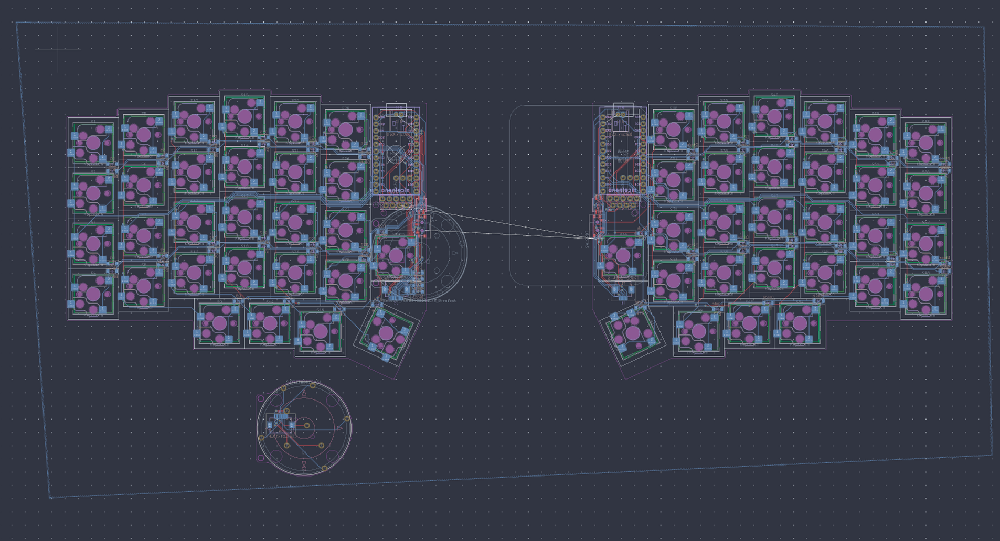

# Quartz58

Attempt at a two places removed, no compromises keyboard

Inspired by the lily58, SoflePLUS2, and MANY others to fit my personal needs

## Images

### CAD

Exploded view of the CAD currently

### PCB

With the fill!

### Schematic

The reason why I made this project was that I was always fascinated by keyboards, especially the ergonomic ones, and I just love designing things. So since this was my chance to try it, so I jumped at it!

## Features

### Key Features

- **58 keys**, each able to support at the same time, MX and Choc hotswap sockets!

- **Wireless**, with the power of a nice!nano clone and a 750mAh battery!

- **iPod-style Encoder** on the left side for any encoder needed jazz... (such as volume control)

- **Trackpad** on the right side, for any analog needed or gesture related jazz pt2... (such as precision or window management)

- **Gasket Mount**, for improved typing feel and acoustics

- **MagSafe Magnets**, for adjustable tenting and compatibility with existing MagSafe accessories!

- **nice!view and OLED Display Support** on both halves to show stats like battery life, WPM, connection status, etc...

## Development Log

See [JOURNAL.md](JOURNAL.md) for detailed development progress and decisions

## BOM

| Part                                                          | Qty | Price/per (CAD) | Total      | Link                                                                                                                 | Shipping (CAD) | Notes                                                                                            |
| ------------------------------------------------------------- | --- | --------------- | ---------- | -------------------------------------------------------------------------------------------------------------------- | -------------- | ------------------------------------------------------------------------------------------------ |
| 10cm 10p 0.5mm pitch 10PCS FPC FFC Ribbon Flexible Flat Cable | 1   | 7.45            | 7.45       | [link](https://www.aliexpress.com/item/1005006420267064.html)                                                        | 0              |                                                                                                  |
| 6cm 10p 0.5mm pitch 10PCS FPC FFC Ribbon Flexible Flat Cable  | 1   | 7.44            | 7.44       | [link](https://www.aliexpress.com/item/1005006420267064.html)                                                        | 0              |                                                                                                  |
| 404090 2000mAh Battery                                        | 2   | 7.49            | 14.98      | [link](https://www.aliexpress.com/item/1005009607827493.html?mp=1)                                                   | 10.27          |                                                                                                  |
| TPS65-201A-S                                                  | 1   | 8.93            | 8.93       | [link](https://www.mouser.ca/ProductDetail/Azoteq/TPS65-201A-S?qs=pfd5qewlna5Lh8O0E8DcUQ%3D%3D)                      |                |                                                                                                  |
| FH12-6S-0.5SH(55)                                             | 4   | 1.91            | 7.64       | [link](https://www.mouser.ca/ProductDetail/Hirose-Connector/FH12-6S-0.5SH55?qs=Ux3WWAnHpjC%252BfBkf%252BkEyew%3D%3D) |                |                                                                                                  |
| FH12-10S-0.5SH(55)                                            | 4   | 1.97            | 7.88       | [link](https://www.mouser.ca/ProductDetail/Hirose-Connector/FH12-10S-0.5SH55?qs=Ux3WWAnHpjDbjH5OXeBUGQ%3D%3D)        | 20             | two extra due to acidents as its a surface mount component with plastic (i.e. iont trust myself) |
| Nice!view                                                     | 1   | 28              | 28         | [link](https://typeractive.xyz/products/nice-view?variant=44753694228711)                                            |                |                                                                                                  |
| Machine Sockets and Pins                                      | 2   | 10              | 20         | [link](https://typeractive.xyz/products/machine-sockets-and-pins?variant=45741664469223)                             |                |                                                                                                  |
| Power Switch                                                  | 1   | 3               | 3          | [link](https://typeractive.xyz/products/power-switch)                                                                |                |                                                                                                  |
| Reset Button                                                  | 1   | 3               | 3          | [link](https://typeractive.xyz/products/reset-button)                                                                |                |                                                                                                  |
| Battery Jack                                                  | 1   | 2               | 2          | [link](https://typeractive.xyz/products/battery-jack?variant=45597492707559)                                         |                |                                                                                                  |
| Kailh Hot-swappable Socket 10 per pack                        | 6   | 3               | 18         | [link](https://typeractive.xyz/products/hotswap-sockets?variant=45742200291559)                                      | 0              | I changed this from ali to this, so I can get free shipping                                      |
| PCB from JLCPCB                                               | 1   | 23.28           | 9.53       | [link](https://cart.jlcpcb.com/quote?rand=0.04393028142638511)                                                       | 37.79          | -13.75 coupon                                                                                    |
|                                                               |     |                 |            |                                                                                                                      |                |                                                                                                  |
| **Subtotal:**                                                 |     | **CAD:**        | **137.85** | **Shipping Total:**                                                                                                  | **68.06**      |                                                                                                  |
|                                                               |     | USD             | 99.85      |                                                                                                                      | 49.30          |                                                                                                  |
|                                                               |     | **Total:**      | **149.15** |                                                                                                                      |                | Will make up the difference if there are any hidden costs                                        |
|                                                               |     |                 |            |                                                                                                                      |                |                                                                                                  |

### Stuff I will buy

| Part                                        | Qty | Price/per (CAD) | Total | Link                                                               | Shipping (CAD) | Notes |
| ------------------------------------------- | --- | --------------- | ----- | ------------------------------------------------------------------ | -------------- | ----- |
| M2 (OD3.2mm) 50pcs x 2mm                    | 1   | 3.02            | 3.02  | [link](https://www.aliexpress.com/item/1005005220632314.html)      | 0              |       |
| NRF52840                                    | 2   | 4.32            | 8.64  | [link](https://www.aliexpress.com/item/1005006271779544.html?mp=1) | 0              |       |
| SOD-123                                     | 1   | 2.79            | 2.79  | [link](https://www.aliexpress.com/item/1005006323468521.html)      | 0              |       |
| Magsafe Magnet Rings 15 plus version        | 2   | 5.49            | 10.98 | [link](https://www.aliexpress.com/item/1005006981590979.html)      | 0              |       |
| M2x16mm Hex Socket Head Cap                 | 1   | 2.9             | 2.9   | [link](www.aliexpress.com/item/32810872544.html)                   | 0              |       |
| 20 PCS 2MM Thick Mechanical Keyboard Gasket | 1   | 7.4             | 7.4   | [link](https://www.aliexpress.com/item/1005004800667967.html)      | 0              |       |

### These are the stuff that I will get at a later date and/or reusing from old stuff

| Part              | Qty | Price/per (CAD) | Total | Link                                                          | Shipping (CAD) | Notes                                                     |
| ----------------- | --- | --------------- | ----- | ------------------------------------------------------------- | -------------- | --------------------------------------------------------- |
| White keycap set  | 1   |                 |       |                                                               |                | Already have                                              |
| White MX switches | 1   | 51.38           | 51.38 | [link](https://www.aliexpress.com/item/1005006856018973.html) | 0              | Will use old for now                                      |
| TSWB3NCB111LFS    | 1   | 14.54           | 14.54 | XCMKB                                                         | 48.48          | This is a custom order to them as they ship from malasyia |
